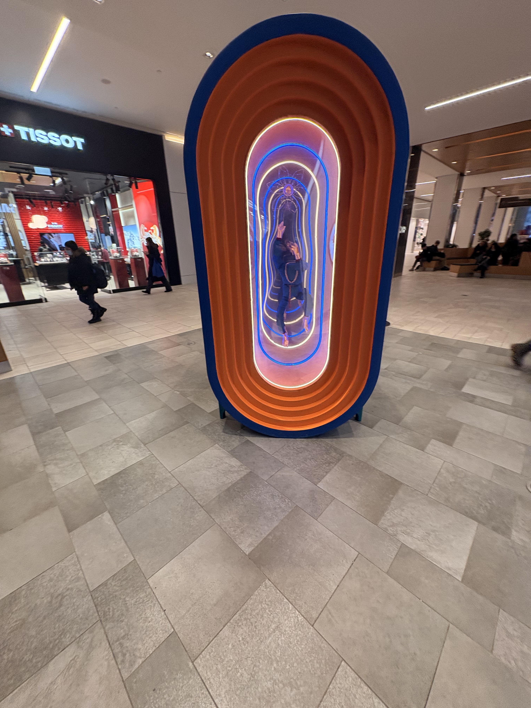

# LUMINO: ENTRE MAINTENANT ET L'INFINI
---
­

*photo cartel exposition, photo prise par Noah-Charles Yoou*

---
## Lieu de mise d'exposition 
Centre Eaton de Montréal

---

*Moi (Noah-Charles Yoou) devant le carte, photo prise par Yanis Ait-Rabah*

---

*Moi (Noah-Charles Yoou) devant l'édifice , photo prise par Yanis Ait-Rabah*

---
## Type d'exposition
Temporaire (intérieur)

*L'ouevre "ENTRE MAINTENANT ET L'INFINI", photo prise par Noah-Charles Yoou*

---
## Date de visite
27 février 2026

---
## Titre de L'oeuvre choisi
### ENTRE MAINTENANT ET L'INFINI

*Totalité du cartel, photo prise par Noah-Charles Yoou*

---
## Nom de l'artiste
### Jérémy Shantz

---
## Année de réalisation
27 Novembre 2025 au 8 Mars 2026

---
## Description de l'oeuvre
L'oeuvre consiste d'un cylindre ovale avec un contour extérieur bleu et plusieurs couches d'intérieur orange. Le centre des deux côtés possède une vitrine ovale. Le centre possède aussi des néons de plusieurs couleurs (vert, blanc, bleu, orange). Le tout est supporté par 4 petites pattes de couleur turquoise foncé. On peut remarquer qu'il y a une séparation au centre de l'oeuvre. Derrière la vitrine sur un côté de l'exposition on peut observer une sorte de mascotte sans tête avec des mains et pieds en or. Son corps est enrobé d'une fabrique bleu foncé et de deux chaînes dorées. La mascotte semble être suspendue au centre de la vitrine. Une fleur faite avec des filaments dorés semble aussi être suspendue. De l'autre côté de l'exposition, il y a une autre vitrine qui elle aussi a un objet à l'intérieur. Un bâton avec deux fleurs blanches suspendues aux extrémités. Les fleurs sont attachées par des boules dorées. 

*Le derrière de l'ouevre "ENTRE MAINTENANT ET L'INFINI" d'un point de vue rapproché, photo prise par Noah-Charles Yoou*

---
## Type d'installation
### interactive

*L'ouevre "ENTRE MAINTENANT ET L'INFINI" d'un point de vue rapproché, photo prise par Noah-Charles Yoou*

---
## mise en l'espace

*image dessinée du croquis, photo prise par Noah-Charles Yoou*

---
## Composante et technique 
- structure ovale
- miroir déformants
- lumière néon
- support de la structure
- mascotte 
- bâton avec fleur
---

*Le derrière de l'ouevre "ENTRE MAINTENANT ET L'INFINI" d'un point de vue rapproché, photo prise par Noah-Charles Yoou*

---

*L'ouevre "ENTRE MAINTENANT ET L'INFINI" de coté, photo prise par Noah-Charles Yoou*

---
## Élément nécessaire à la mise d'exposition
- espace intérieur
- éclairage
---

*L'ensemble de l'oeuvre, photo prise par Noah-Charles Yoou*

---

*L'éclairage au plafonds, photo prise par Noah-Charles Yoou*

---
## Expérience vécu
J'ai trouvé l'expérience plutôt bien. La mise en scène de l'oeuvre était bien pour ce que c'était. Il n'y avait pas trop de monde, donc c'était facile de se promener et observer l'oeuvre et l'apprécier sans être dérangé. J'étais inquiet de ne pas réussir à trouver l'exposition mais c'était le contraire. Le cartel était informatif.

---
## Ce qui m'a plus
JJ'ai bien aimé les couleurs et l'esthétique de l'art. Les éléments à l'intérieur des vitrines me rappelaient vivement un cercle. Les couleurs utilisées (bleu/orange) faisaient un très beau contraste et te gardaient plutôt captivé par l'oeuvre. J'ai aussi bien aimé la rondeur et les différentes couches d'orange du cylindre ovale. Il était plaisant à regarder.

---
## Ce que je ferais différement
Si j'avais à faire les choses différemment j'essayerais de rendre l'oeuvre soit plus interactive ou plus artistique pour mieux captiver l'attention des visiteurs. L'oeuvre est très belle à regarder, mais une fois que tu as fait le tour elle devient plutôt plate. Je pense qu'elle pourrait bénéficier de plus d'interactivité, par exemple d'avoir les néons qui changent de couleur, les éléments qui sont derrière la vitrine qui bougent ou même simplement ajouter des speakers pour rajouter une petite ambiance sans trop perturber. Sinon si l'oeuvre avait à être plus artistique, cela aurait été bien d'avoir plus d'éléments qui causent une réflexion plus poussée. Après m'être renseigné sur le site web, je n'ai pas senti/compris la vision que l'artiste a essayé de nous partager. Je la trouvais simple et je pense qu'elle aurait pu être plus développée.

