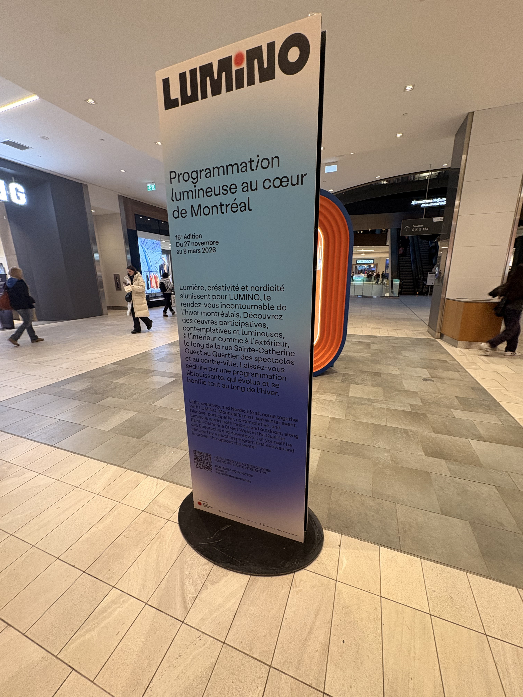
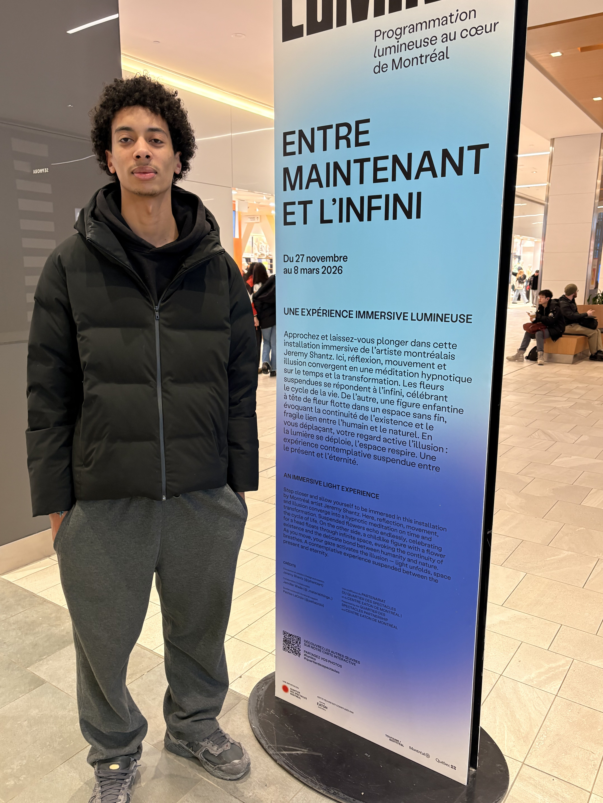
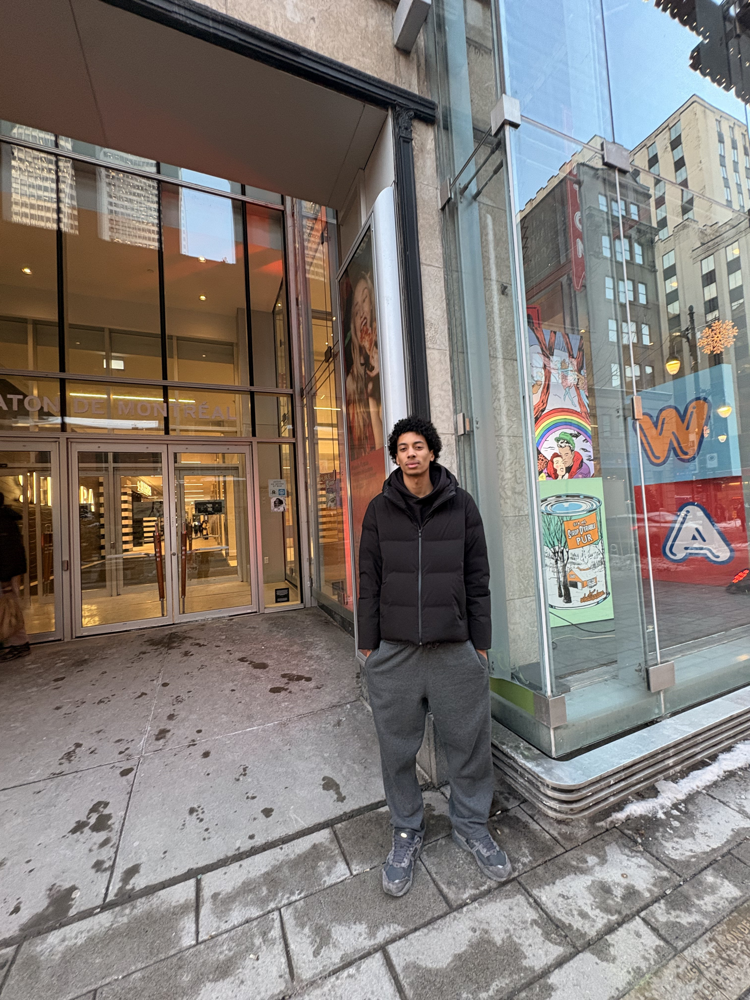
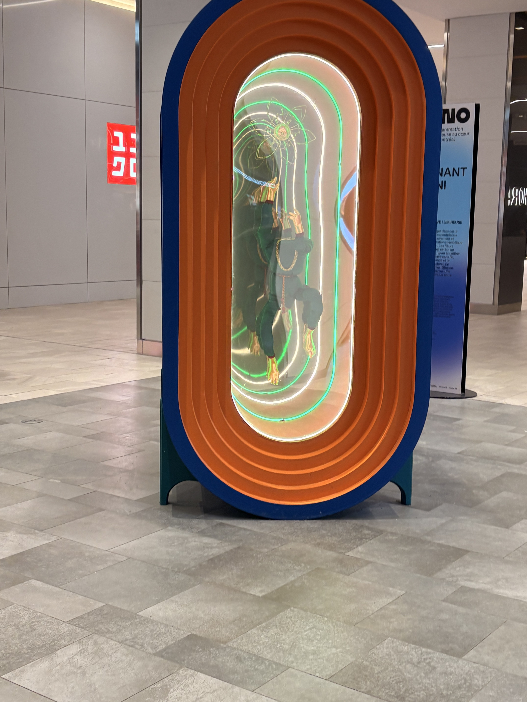
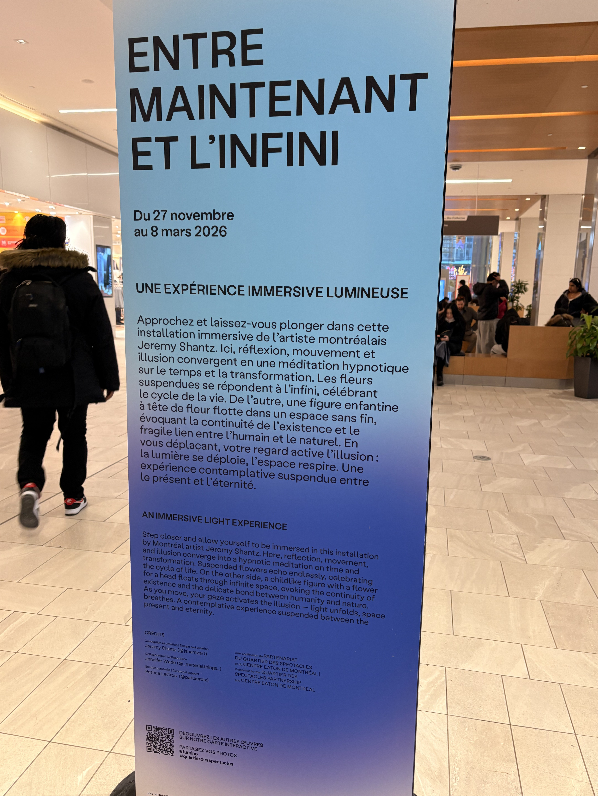
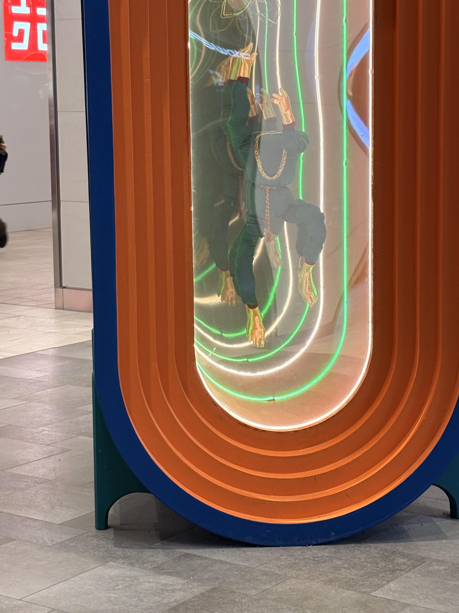
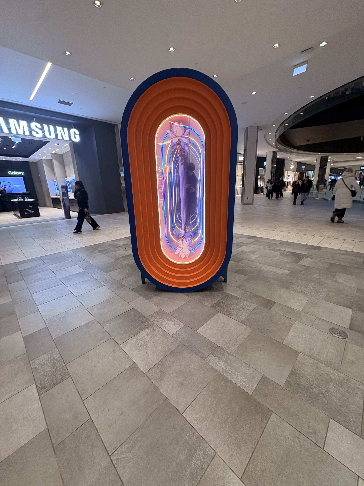
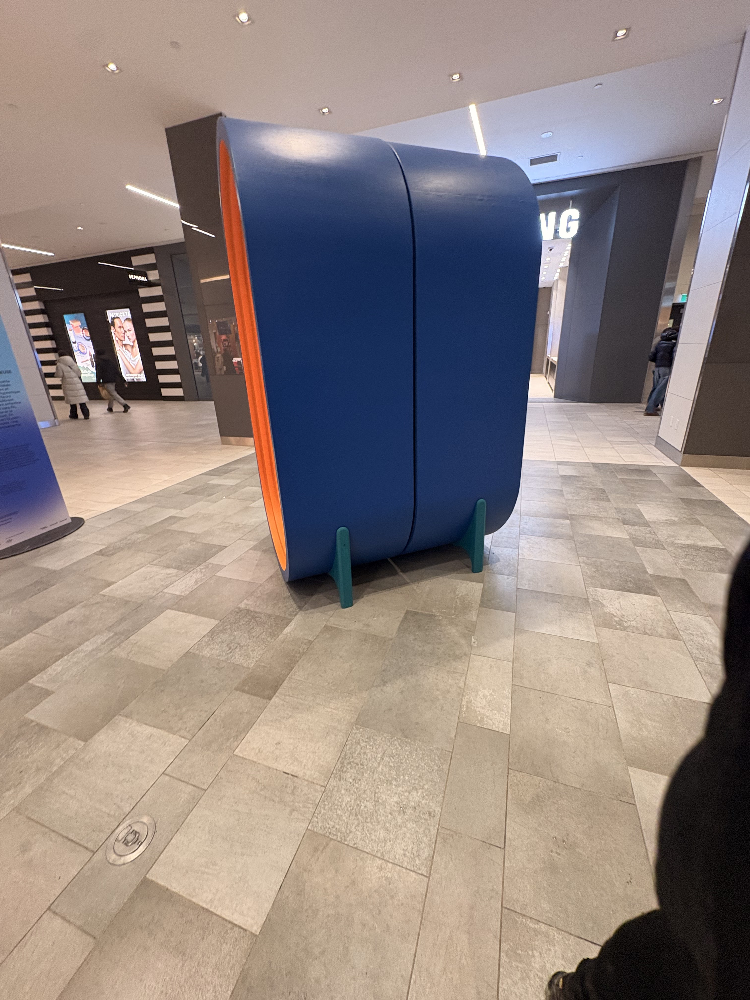
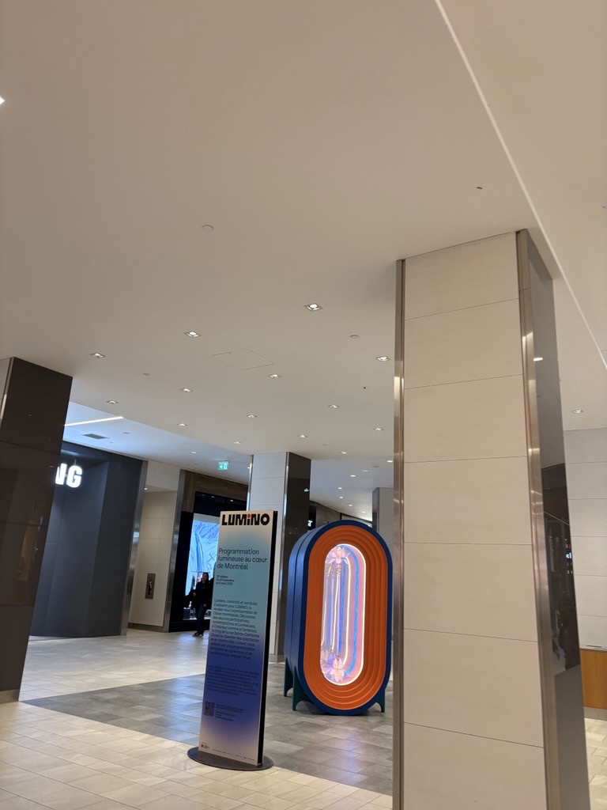
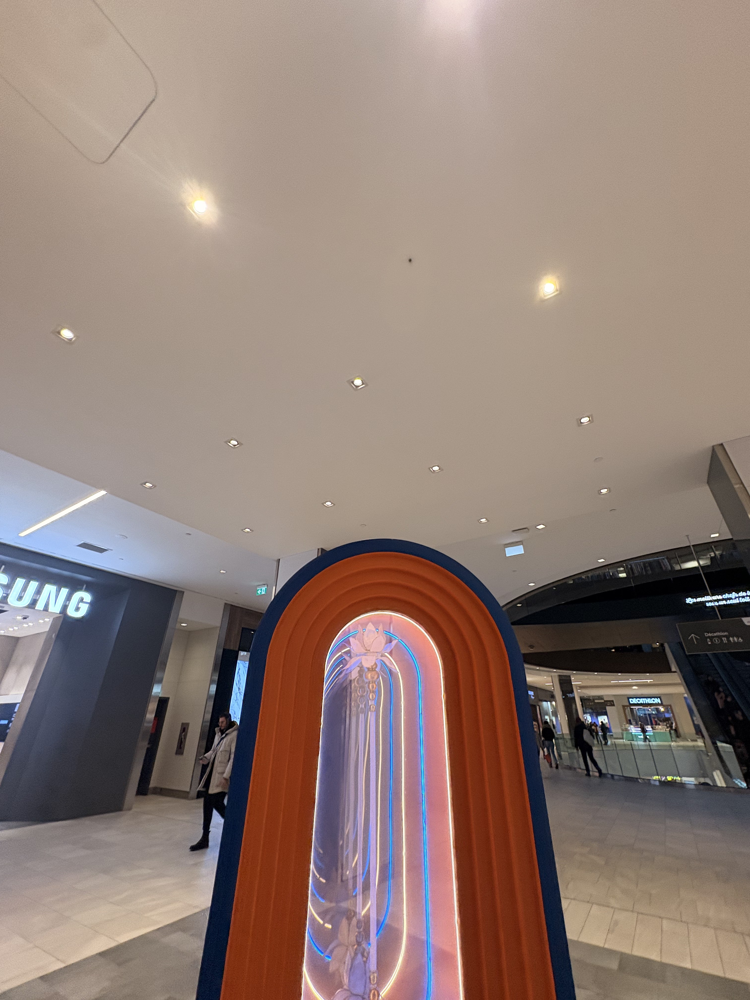

# LUMINO: ENTRE MAINTENANT ET L'INFINI
---
­

*photo cartel exposition, photo prise par Noah-Charles Yoou*

---
## Lieu de mise d'exposition 
Centre Eaton de Montréal

---

*Moi (Noah-Charles Yoou) devant le carte, photo prise par Yanis Ait-Rabah*

---

*Moi (Noah-Charles Yoou) devant l'édifice , photo prise par Yanis Ait-Rabah*

---
## Type d'exposition
Temporaire (intérieur)

*L'ouevre "ENTRE MAINTENANT ET L'INFINI", photo prise par Noah-Charles Yoou*

---
## Date de visite
27 février 2026

---
## Titre de L'oeuvre choisi
### ENTRE MAINTENANT ET L'INFINI

*Totalité du cartel, photo prise par Noah-Charles Yoou*

---
## Nom de l'artiste
### Jérémy Shantz

---
## Année de réalisation
27 Novembre 2025 au 8 Mars 2026

---
## Description de l'oeuvre
L'oeuvre consite d'un cylindre oval avec un contour extérieur bleu et plusieur couche d'intérieur orange. Le centre des deux cotées possede une vitrine oval. Le centre possède aussi des néons de plusieurs couleur(vert,blanc,bleu,orange). Le tout est supporter par 4 petite pattes de couleur turquoise foncé. On peut remarqué qu'il a une sepation aucentre de l'oeuvre. Derrière la vitrine sur un coté de l'exposition on peut observer une sorte de mascotte sans tête avec des mains et pieds en or. Son corps est enrobé d'une fabrique bleu foncé et de deux chaine dorée. La mascotte semble être supendu au centre de la vitrine. Une fleure faite avec des fillament doré semble aussi être suspendu. De l'autre coté de l'exposition, il a une autre vitrine qui elle aussi a un objet a l'intérieur. Un baton avec deux fleur blanche suspendu aux extrémité. Les fleures sont attacher par des boules dorées. 

*Le derrière de l'ouevre "ENTRE MAINTENANT ET L'INFINI" d'un point de vue rapprocher, photo prise par Noah-Charles Yoou*

---
## Type d'installation
### interactive

*L'ouevre "ENTRE MAINTENANT ET L'INFINI" d'un point de vue rapprocher, photo prise par Noah-Charles Yoou*

---
## mise en l'espace

*image dessiné du croquis, photo prise par Noah-Charles Yoou*

---
## Composante et technique 
- structure ovale
- miroir déformants
- lumière néon
- support de la structure
- mascotte 
- batton avec fleur
---

*Le derriere de l'ouevre "ENTRE MAINTENANT ET L'INFINI" d'un point de vue rapprocher, photo prise par Noah-Charles Yoou*

---

*L'ouevre "ENTRE MAINTENANT ET L'INFINI" de coté, photo prise par Noah-Charles Yoou*

---
## Élément nécessaire à la mise d'exposition
- espace intérieur
- éclairage
---

*L'ensemble de l'oeuvre, photo prise par Noah-Charles Yoou*

---

*L'éclairage au plafonds, photo prise par Noah-Charles Yoou*

---
## Expérience vécu
J'ai trouver l'expérience plutot bien. La mise en scène de l'oeuvre était bien pour se que c'etait. Il n'avait pas trop de monde , donc c'était facile de ser pormener et observer l'oeuvre et l'apprécié sans etre deranger. J'était inqiet de ne pas réussir a trouver l'exposition mais c'etait le contraire. Le cartel était informatif.

---
## Ce qui m'a plus
J'ai bien aimer les couleurs et l'aethétiques de l'art. Les élélments a l'intérieur desa vitrines me rappelait vivement un circle. Les couleur utilisés (bleu/orange) fesait un très beau contraste et te gardait plutot capitvé par l'oeuvre. J'ai aussi bien aimé la rondeur et les différente couche de orange du cylindre oval. il était plaiseant a regarder. 

---
## Ce que je ferais différement
Si j'avais a faire les choses différement jessayerais de rendre l'ouvre soit plus intéractif ou plus artistique pour mieux captiver l'attention des vistuers. L'oeuvre est tres belle a regarder ,mais une fois aque tu as fait le tour elkle devient plutot plate. Je pense quelle pourrait bénéfisier de plus d'interactivité, par exemple de avoir les néon qui change de couleur, les élément qui sont dérriere la vitrine qui bouge ou meme de simplement ajouter des speaker pour rajouter une petite ambimace sans trop pertuber. Sinon si l'oeuvre avait a etre plus artisque, cela aurait bien d'avoir plus d'élément qui cause une réflection plus pousser. Après m'avoir renseigner sur le site web, je n'ai pas senti/compris la vision que l'artiste a essayer de nous partager. Je la trouvais simploe et je pense qu'elle aurait etre plus déveloper.

