# Devenir partages pratique de l'IA
---
![photo cartel exposition: marche seulement par un lien]­(https://github.com/noahcyoou/H26_V11_inspiraton_Yoou/blob/main/Galerie_UDEM/media/cartel%20_exposition_photo_jb.jpg?raw=true)

---
## Lieu de mise d'exposition 
Galerie de l’Université de Montréal

---
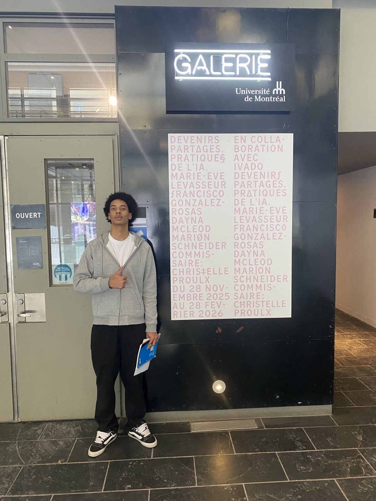
*Noah devant l'édifice*

---
## Type d'exposition
Temporaire (intérieur)
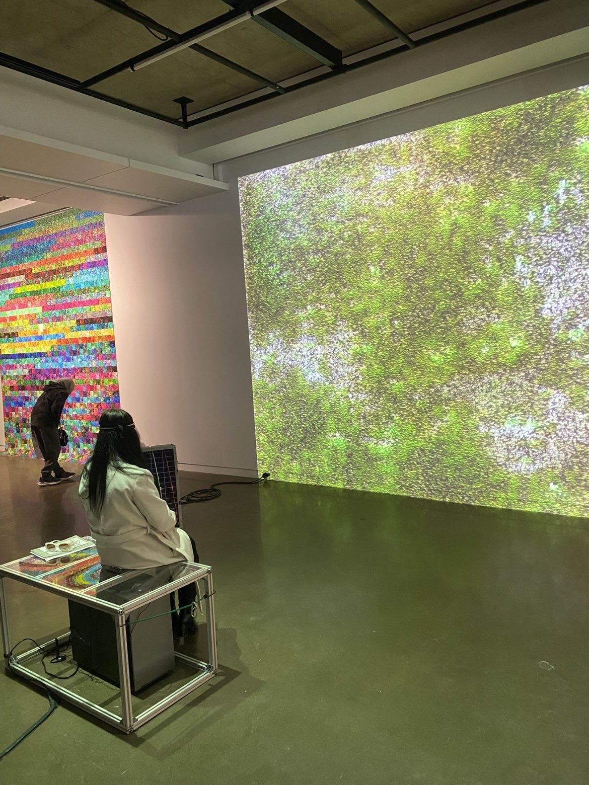
*L'oeuvre "Terre Commune"*

---
## Date de visite
2026 janvier 30

---
## Titre de L'oeuvre choisi
### Terre commune
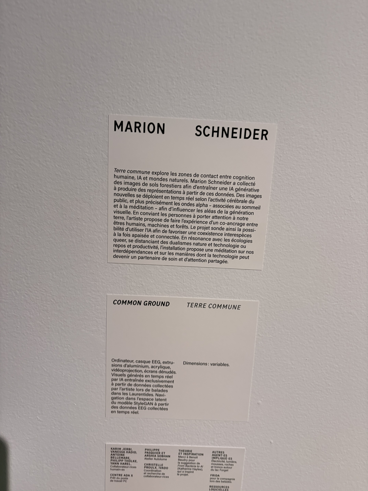
*Totalité du cartel*

---
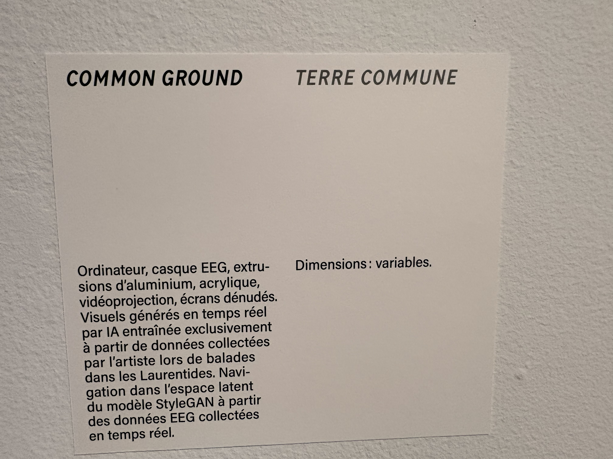
*Explication de l'oeuvre par le cartel*

---
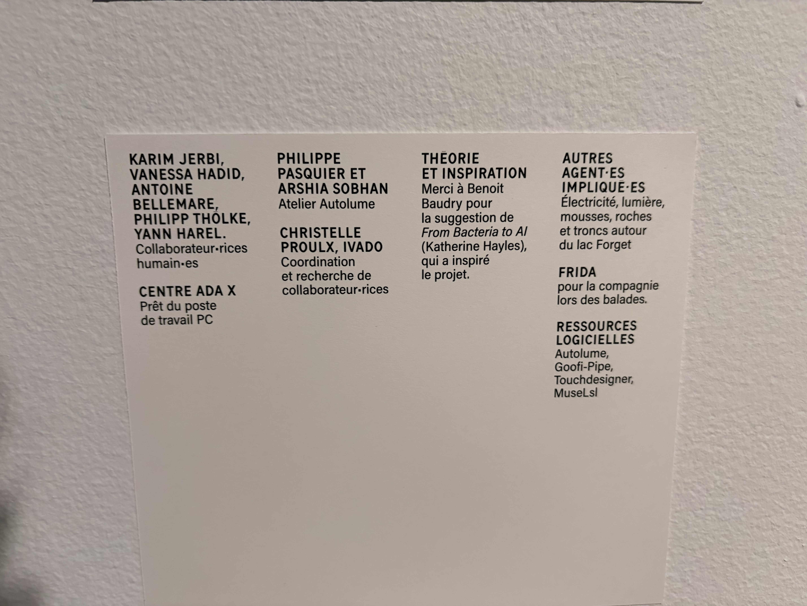
*Les collaborateurs de l'oeuvre enoncé par le cartel*

---
## Nom de l'artiste
Marion Schneider
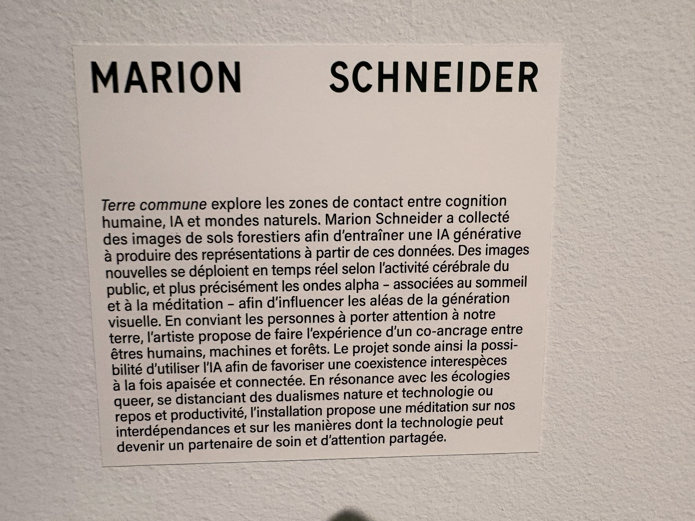
*Biographie de l'oeuvre selon la vision de Marion Schneider*

---
## Année de réalisation
2025 novembre 28 au 2026 février 28

---
## Description de l'oeuvre
L'oeuvre est consitué d'un ordinateur qui encadré par un case de vitre. Le principe est de mettre un bandeau qui lui vas capter les ondes émit par ton cerveau. Ses ondes vont ensuite être diffuser sur un écran qui lui est brancher a lordinateur encadrer de vitre. Le tout/résultat vas ensuite être projeté par un projecteur sur un mure blanc.

---
## Type d'installation

*La projection de l'art sur le mure*

---
immmersive/interactive

## mise en l'espace
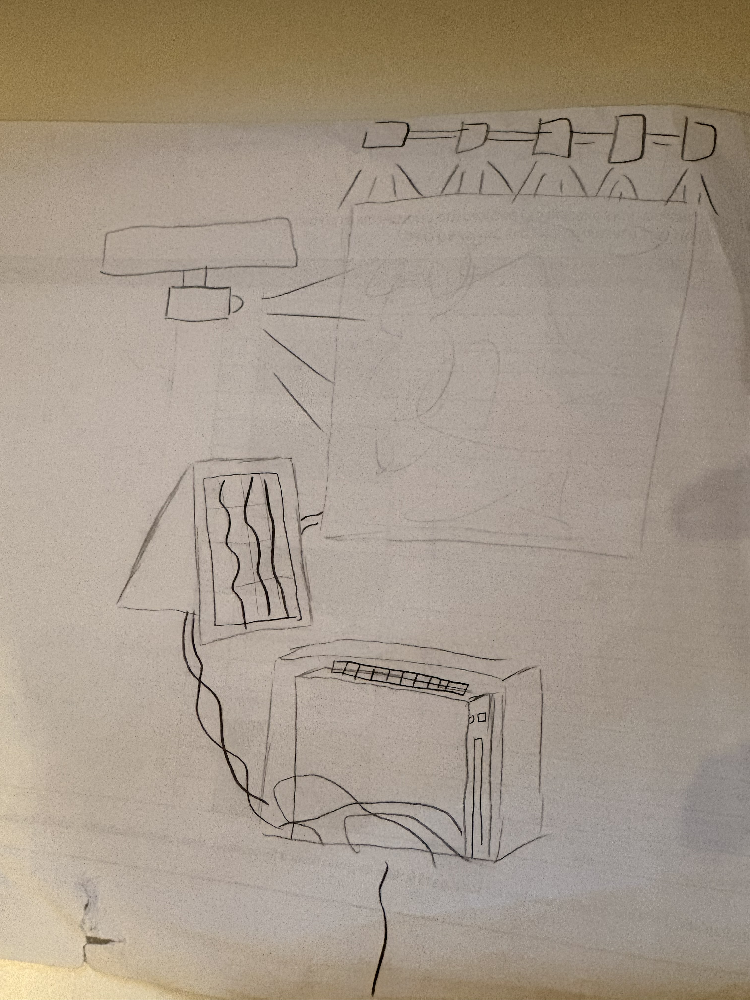
*image dessiné du croquis*

---
## Composante et technique 
- ordinateur
- projecteur
- écran
- encadrement de vitre
- bandeau de capteur d'onde omega
- câble
---
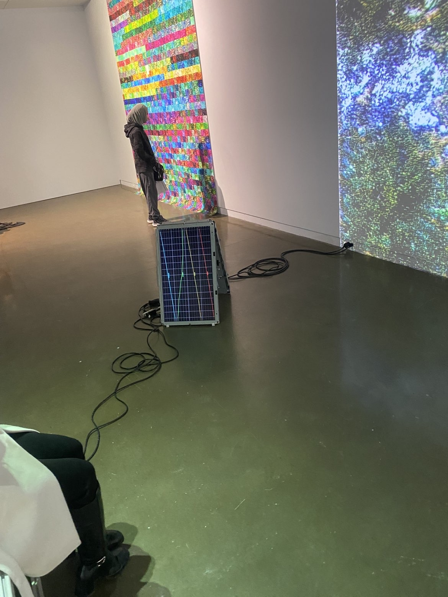
*L'écran qui projette les ondes*

---
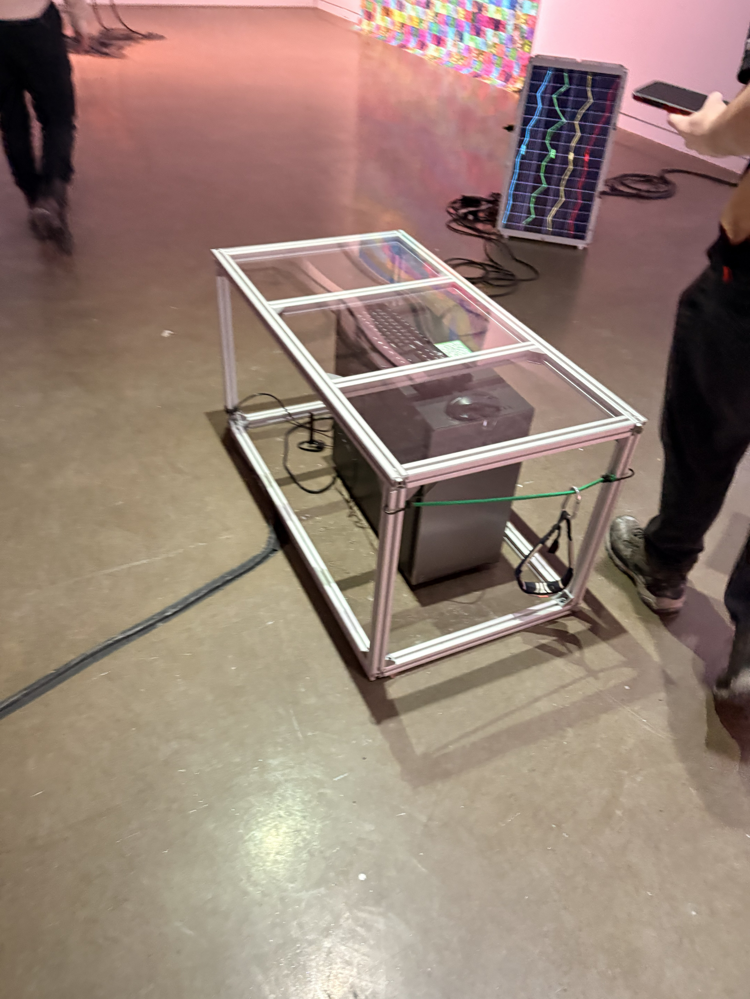
*ordinateur qui est encadré par un case de vitre*

---

*L'ensemble des cables branchés*

---
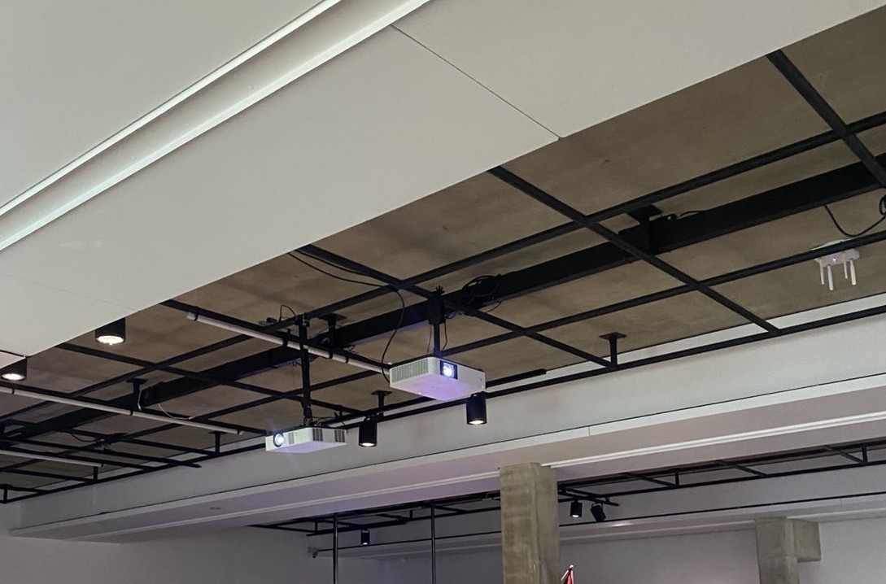
*Le projecteur accroché au plafond*

---
## Élément nécessaire à la mise d'exposition
- mure
- structure pour éclairage
---

*L'ensemble de l'oeuvre*

---
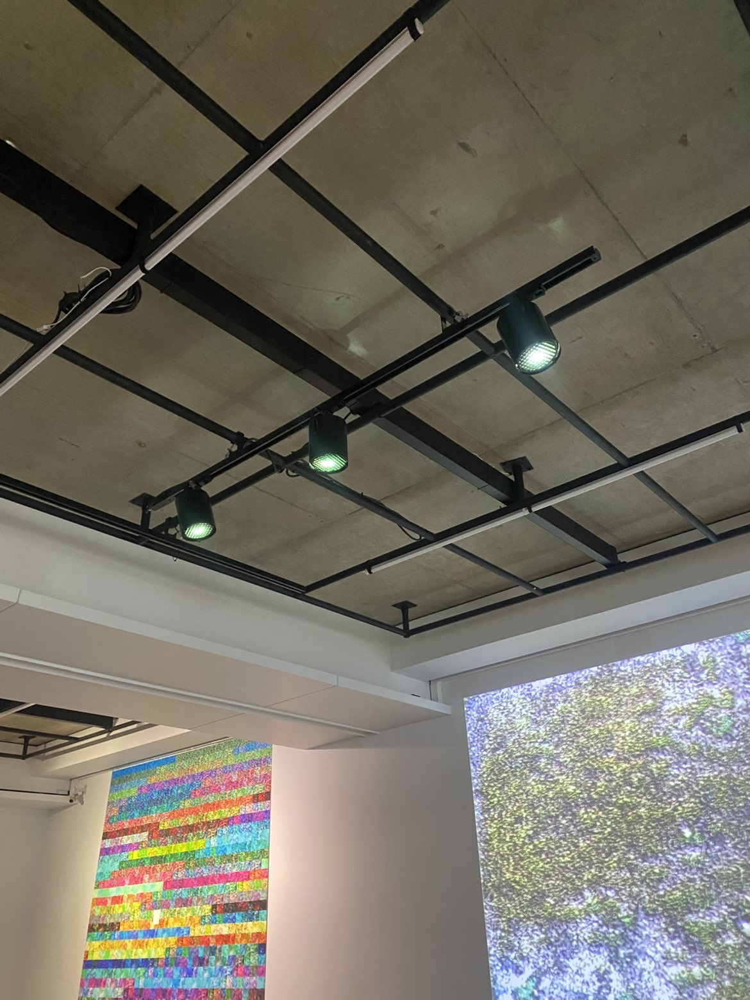
*L'éclairage au plafonds*

---
## Expérience vécu
J'ai beaucoups aimer ma visite a la galerie d'UQUAM. J'ai trouver le concept super origianle d'avoir de l'IA melanger avec l'art. Tout les projets était super intéressant et original. Je n'était pas sure si le concept 
de mélange avec l'art et l'intélligence artificielle allait marcher, mais au final cela a produit des oeuvres que personellement j'aurais pas penser possible. Souvent on utilise l'IA pour poser des question et accomplir des taches simples, 
donc de le voir être utiliser dans un context artistique est super captivant.
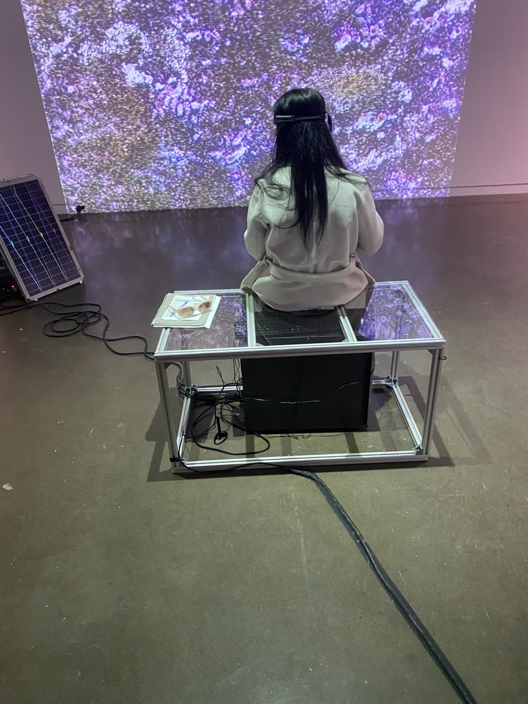
*Participant qui intéragit avec l'ouevre*

