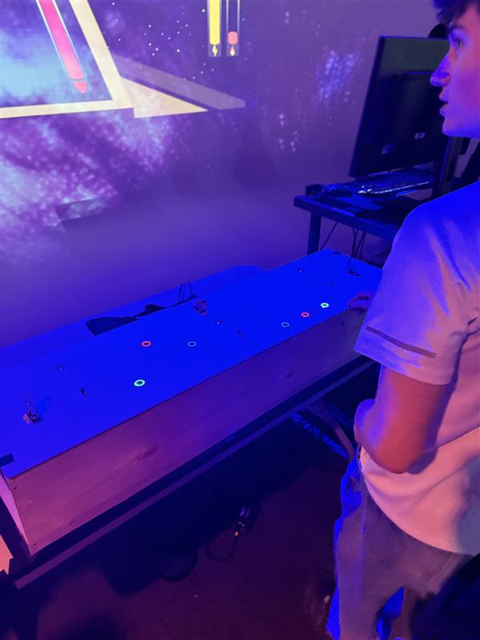

# Palmares des expositions étudiant finissant TIM

## Mission Décollage
### noms des créateurs et créatrices:
Ahmed Kaissoumi, Radhouane Kordan, Justin Montpetit, Thearylou Lach, Jad Saloumi

---
### Installation en cours (ou finale)

### Schéma de l'installation prévue

> source des deux images --> *https://o-i-g-n-o-n.github.io/Mission-decollage/#/technique/*
### Ce que j'ai ressenti en expérimentant cet installation, avec justification (avant/après l'expérimentation)
#### Avant:
J'ai beaucoup aimer la premiere version de se projet. J'aimais beaucoup le concept. C'est quelque chose que je n'avais jamais vus et que je trouvais très originale.
Cepenadnt je l'ai trouver un peut dure a comprendre. Ca a prit plusieurs essaie et l'aide de plusieur amis avant de bien comprendre quoi faire exactement. Meme si le jeu etait 
amusant le but n'etait pas claire. Les controles et la globalité du concept etait tres amusant par contre
#### Après:
Il a eu une très belle amélikoration dans le projet. L'objectif était plus claire et les instructions sur quest se que chaque bouttons fait etait plus claire. Des instructions/"warning" on aussi été rajouter pour 
meiux expliquer au joueur quel sont les taches a accomplir. Super belle additions cela a vraiment rendu le jeux plus facile a maitriser des que tu commences a jouer. Un changement qui a significtivement ameliorer le jeux

---

## Symbiose
### noms des créateurs et créatrices:
Yannick Chamberland, Benjamin Ferland, Walid Cheour

---
### Installation en cours (ou finale)

### Schéma de l'installation prévue

> source des deux images --> *https://les-chimistes.github.io/symbiose/#/technique/*
### Ce que j'ai ressenti en expérimentant cet installation, avec justification
#### Avant: 
Le jeux était vraiment plaisent a jouer des le debut. C'etait un de mes préféré. Si je me trompe pas il n'avait pas d'objectif fixe au début.
Cela rendait le jeux amusant mais au bout d'un moment un peu annuyant si tu continue a reussir les objectif sans perde. EN globale j'ai bien aimer
#### Après:
Ils ont améliorer la qualité des instrument que tu utilises pour qui te lache pas et se "brise" durant que tu joue. Un but aussi a été rajouter. 
J'ai bien aimés ses additoins car cela a rendu le jeux plus concret. Tu avais vraiment des taches a respecter et a faire en équipe pour réussir.

---

## Quand les yeux se croisent
### noms des créateurs et créatrices:
Edelwyn Ledru, Félix Lavoie, Jade Hébert, Manel Yaya, Patricia Nassif

---
### Installation en cours (ou finale)

### Schéma de l'installation prévue

> source des deux images --> *https://emersiaa.github.io/Quand-les-yeux-se-croisent/#/technique/*
### Ce que j'ai ressenti en expérimentant cet installation, avec justification
#### Avant:
Durant la premiere visite les photo montrée etait un inconsistente. Il avait aussi plusieurs fils qui dépassait et qui était exposer. Cependant la direction 
artistique était super bien réussi. L'aesthétic globale du projet était vraiment bien exécuter. Tu savais exactement ce que l'équipe on essayer de partager. 
En plus d'etre plutot bien assembler la technologie impréssionnnate des télévision rétro qui projet tes yeux grace au camera ainsi que la présentation artisque des 
autre élémemnt rendait le projet encore meilleur.

#### Après:
Tout les petites imperfections ont été régler. Les fils ne depaissaient plus, toute etait mieux organiser. Les images qui était projetter apres avoir été prit en video par la caméra etaient aussi mieux. Mieux cadrer, mieux choisi  et un 
meilleur durée. Pour rajouter la cerise sur le gateau la direction artistique est resté super consitente et belle. J'ai beaucoup aimer la créativité de se projet.

---
## Océan rouge
### noms des créateurs et créatrices:
Amira Tounekti, Kristy Moussally

---
### Installation en cours (ou finale)

### Schéma de l'installation prévue

> source des deux images --> *https://deux-intelligence.github.io/deux-neurones/#/technique/*
### Ce que j'ai ressenti en expérimentant cet installation, avec justification
#### Avant:
J'ai bien aimer la premère version de se projet. C'etait un simulateur relaxent et plutot apaisant a jouer. Les modeles 3D etait bien et le arts styles était beau. Le jeu était simple a comprendre et 
un jeu relativemaent intuitive. Sa simplicité était son point fort.
#### Après:
Personllement je pense que je préférais plus la premiere version du projet. Jai trouver que laddition du cercle noir qui cache une partie de l'écran était unitile et que le projet était beaucoups mieux sans
. En plus du cercle noir ajouter la mechanique de jeu avec la saleté a été ajouter. En précipe c'est bien mais elle aurait pus etre mieux exécuter. On dirait que tout les nouveaux élément fait pour ajouter une handicape visuel 
on fait que le jeux a perdu un peu se qui le rendait bien de base. Sinon en globale il est bien mais je prefere definitivement l'ancienne version.

---

## Arbre-en-face
### noms des créateurs et créatrices:
Alexandre Gendron, Mikael Arseneau, Mattieu Willet, Matis Ghariani, Rafael Angon Dubé

---
### Installation en cours (ou finale)

### Schéma de l'installation prévue

> source des deux images --> *https://mammouths.github.io/projet/#/technique/*
### Ce que j'ai ressenti en expérimentant cet installation, avec justification
#### Avant: 
J'ai bien aimer se projet. A premiere vue il semble simple et pas compliquer mais il a réussi a me suprendre. Après avoir parler au créateur du projet j'ai compris que la technologie de recongnition facicale qui enregistre les visage et qui les sauvegarde 
dans une base de donner pour ensuite les faire appparraitre lorsquon intéragit avec les différentes fleurs, était beaucoup plus pousser et developper qu'elle la l'air. Cela ma vraiment impréssionner. C'est peut etre pas le projet le plus "flashy" a premiere vue mais quand 
tu commence a vraimenet t'y intéresser il réussi a te surprendre.
#### Après:
Pour être honnete je n'ai pas fait grande attention a se projet lors de ma deuxième visite. Si je ne me trompe pas la recognistion était meilleur et plus clair mais sinon je ne me souviens pas davoir vus quelque chose qui ma vraiment marque.
Je trouve que après la premiere visite j'avais tout vus. Encore une fois le porjet est bien mais se qui le rend vraiment intéressant est la technologie derrière.

---

## Trois cour du programme qui vous semblent incontournables pour avoir les compétences pour créer ce genre de projet
## -Web:
Selon moi, le cour de web me semble incontournable, car tout les projets necéssitent un site web pour pouvoir présenter leur projet. Sans les connaissanse du cour il quasiment impossible de créer son site.
De plus, je pense que le cour de web est un bon début pour apprendre a coder. Ceci est une grande nécesséité pour ce projet une majorité de ceci consite a programmer.
## -Modelisation 3D
Selon moi, je pense que le cour de modelisation 3D est un incontournable, car plus de la majorité des projet on utiliser des model 3d pour valoriser leur porjet. Des projet commme OIGNON, Abre en face et symbiose ont tous majoritairement des visuels 3D. PEut etre qui 
aurait pus les faires en 2D mais leffet et l'experience produite ne seraient pas la meme
## -Programmation interactive
Selon moi, programmation intéractive est le cour le plus important des 3 car on le retrouve dans les 3 projets. C'est vraiment la colle qui tien le tout pour chauqe element de tout les projet ,car il permet de créer le lien entre nous le particpant et l'exposition. Sans l'ajout de programmention on 
ne pourrit tout smimplement pas intéragir avec les rpojet et ca retirais se qui les rend des projet de multimédia
## Nommer et décrire une technique ou une composante technologique qui est utilisée dans l'un des projets et que vous ne connaissiez pas.
Une technique ou composante qui a été dans l'un des projet que je ne connaissais pas est la technologie utiliser dans le projet abre en face. Lorsque on intéragi avec les fleurs nos mouvement sont capter grace a un camera et transmet le signal au projecteur pour faire bouger les différent élément.
Non seulement cela mais la camera très bien placer a l'enter prend une photo seulement de votre visage et l'envoie dans une base de donner qui rotationne les 20 derniere photo qui on été prises. Ceci est super impréssionnnant et marche très bien avec le projet. J'avais deja entendu parler de technologie de la 
sorte mais jamais jy aurais penser l'utiliser d'une tel manière. J'ai été tre supris et captiver par cet nouvelle découvert technologique.
