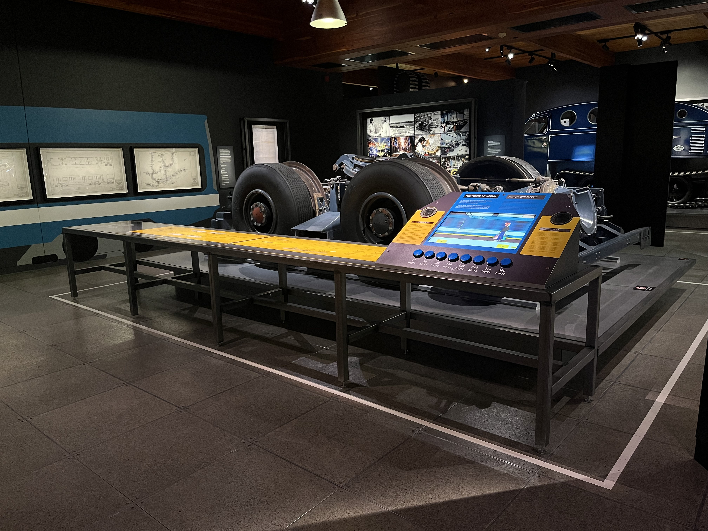

# Conférence - MUSÉE DE L'INGÉNIOSITÉ
## Par Martin Boucher, Technicien multimédia, Musée de l'ingéniosité J.Armand-Bombardier

Lors de cette conférence, Martin Boucher, un technicien en multimédia au Musée de l'ingéniosité J. Armand-Bombardier, nous a présenté un peu ce qu'il fait dans la vie de tous les jours ainsi que les projets sur lesquels il travaille. Son but était surtout de nous montrer comment les installations de leur exposition sont créées et intégrées.

Il nous a expliqué tout le travail caché derrière les machines interactives. Il a donné des exemples concrets comme le projet du métro de Montréal. Ce qui était intéressant, c'est de voir comment ils réussissent à relier l'équipement physique avec les interfaces à l'écran. Il a mentionné qu'il faut bien programmer l'interactivité pour que l'expérience des visiteurs soit fluide. Il a expliqué qu'une grosse partie de sa job consiste à faire de la maintenance. Il doit s'assurer que tout fonctionne chaque matin et réparer puis s'assurer qu'il n'y ait pas de problème technique.Ma partie préférée est lorsqu'il a parlé de ce qu'ils doivent faire s'il y a une panne. Lors de nos questions, il a expliqué que tout dépend des besoins du client et à quelle vitesse il aimerait ramener le service pour faire plaisir aux visiteurs.

Pour conclure, j'ai vraiment apprécié cette présentation. De voir un professionnel de l'industrie nous expliquer ses vrais défis techniques, ça donne une bonne idée de la réalité de c'est quoi le marché du travail. Ça m'a prouvé que ce qu'on apprend en multimédia peut mener à des projets plutôt intéressants dans des endroits comme des musées où tu t'y attends pas que les attractions soient majoritairement des dispositifs de multimédia.

***

> Un aperçu du dispotif sur le métro de montréal. Source de l'image : Site web du Musée de l'ingéniosité (museebombardier.com)
